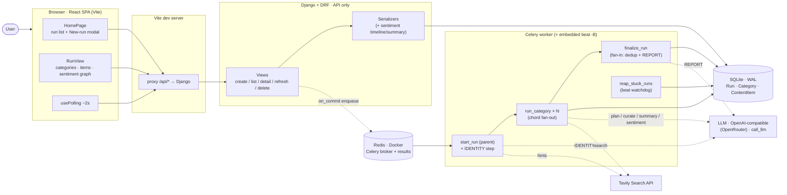
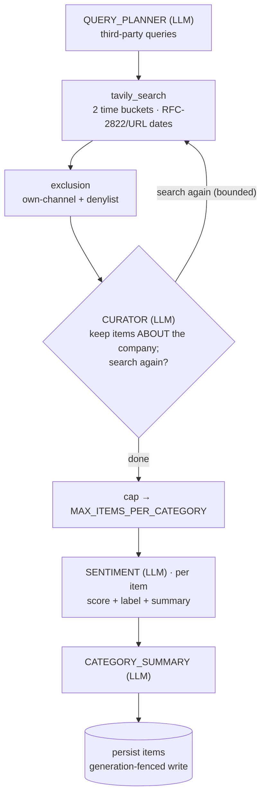

# Drumbeat — Architecture

Locally-run app that, given a company name or URL, runs a background job to find
third-party content about the company, scores each item's sentiment, and
presents a categorised, reviewable list with a sentiment trend. Full design:
`plans/INITIAL.md` (+ `plans/SENTIMENT-DESIGN.md`).

## 1. System / process view

Four processes started by `./start_all.sh`, each on a runtime-discovered port.
The React SPA talks only to the DRF JSON API; all research happens in a Celery
worker; state lives in SQLite; Redis is the Celery broker/result backend.



## 2. Per-category research pipeline

Each `run_category` subtask runs `research_category` (pure, no DB), then persists
its result in one generation-fenced write. The CURATOR may request more searches,
bounded by `CURATOR_MAX_ITERATIONS` / `CURATOR_MAX_SEARCHES`.



Every LLM call goes through one `call_llm(name, …)` with retry + non-fatal
fallback (`call_and_parse`). The six call-points — IDENTITY, QUERY_PLANNER,
CURATOR, CATEGORY_SUMMARY, REPORT, SENTIMENT — each resolve `<NAME>_LLM_*` with
fallback to `DEFAULT_LLM_*`.

## 3. Run lifecycle (create → fan-out → fan-in → poll)

A run is a Celery **chord**: an IDENTITY step, one subtask per selected category
(fan-out), then a fan-in callback. Correctness under refresh/delete/timeout rests
on generation-fenced writes, not task revocation.

```mermaid
sequenceDiagram
  actor U as User
  participant R as React
  participant D as Django/DRF
  participant Q as Redis + Celery
  participant DB as SQLite
  participant E as LLM + Tavily

  U->>R: submit company + options
  R->>D: POST /api/runs/
  D->>DB: create Run + Categories (status=blue)
  D-->>Q: transaction.on_commit → start_run
  D-->>R: 201 → navigate to run-view
  Q->>E: IDENTITY (resolve own domain; non-fatal)
  par per category (chord fan-out)
    Q->>E: plan → search → curate → sentiment → summarize
    Q->>DB: persist items + status (fenced)
  end
  Q->>E: REPORT (executive overview)
  Q->>DB: cross-category dedup + finalize (green/yellow/red)
  loop every ~2s while run is blue
    R->>D: GET /api/runs/{id}/
    D->>DB: read (prefetch categories+items)
    D-->>R: run + categories + items + sentiment
  end
```

## 4. Key invariants (why it looks the way it does)

- **Generation fencing** — every task DB write is guarded by a compare-and-set
  on `Run.generation`; a superseded write raises and rolls back. Refresh/reaper
  bump the generation. This (not `revoke`) guarantees no stale-task clobber.
- **Never hold a DB transaction across an LLM/network call** — the fan-in
  computes dedup + calls REPORT outside any transaction, then one short fenced
  write.
- **Fail loud, with scoped non-fatal exceptions** — missing config stops
  startup; bad API input → 400. IDENTITY, per-item SENTIMENT, and each LLM
  call-point degrade non-fatally (retry, then fallback) so one bad item/reply
  never fails a whole category or run.
- **Status = completeness, not abundance** — GREEN: all categories finished
  cleanly and ≥1 item exists; YELLOW: some category errored/timed out; RED: zero
  items or all errored; BLUE: in progress.
- **Live updates by polling** — two ~2s pollers (home list, run-view); a
  category leaves "running" only after items+summary+ended_at commit, and a run
  leaves "blue" only after overview+ended_at commit, so polling is honest.

## 5. Where things live

| Concern | Module |
|---|---|
| API views / serializers | `research/views.py`, `research/serializers.py` |
| Models (SQLite) | `research/models.py` |
| Celery tasks / orchestration | `research/tasks.py`, `drumbeat/celery.py` |
| Per-category pipeline | `research/pipeline.py` |
| LLM seam + retry | `research/llm.py`, `research/schemas.py` |
| Search seam | `research/tavily.py` |
| URL / exclusion | `research/urls_util.py`, `research/exclusion.py` |
| Generation fencing | `research/fencing.py` |
| Frontend | `frontend/src/components/*`, `frontend/src/usePolling.js` |
| Local orchestration | `start_all.sh`, `run_tests.sh` |
```
